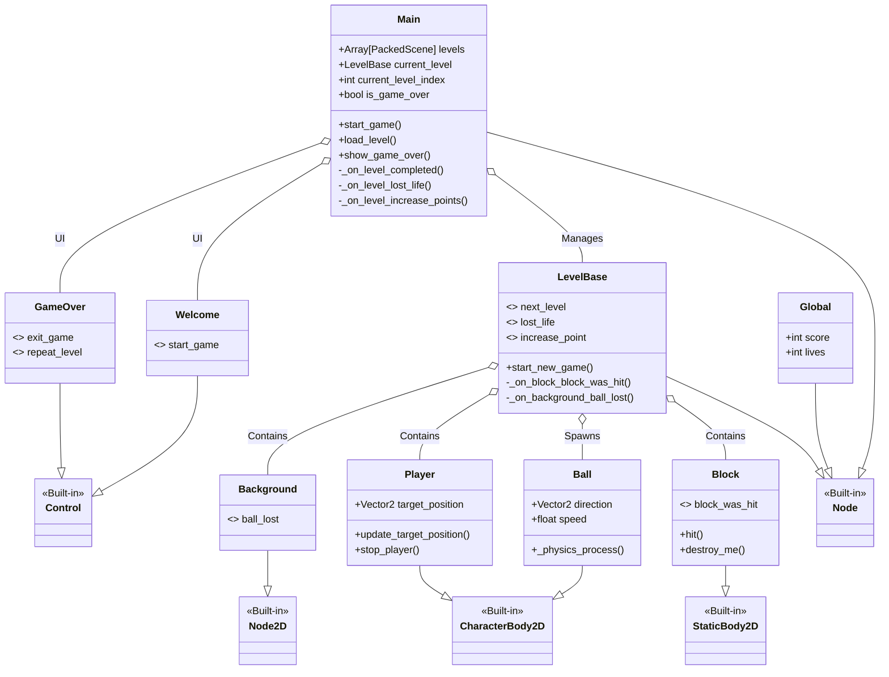
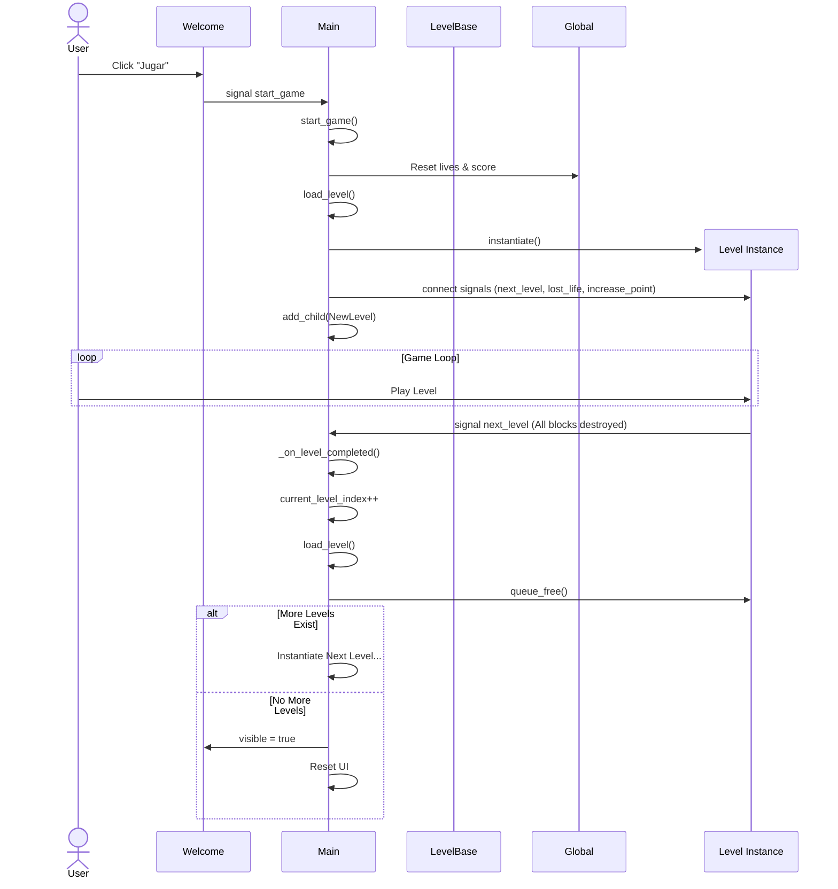
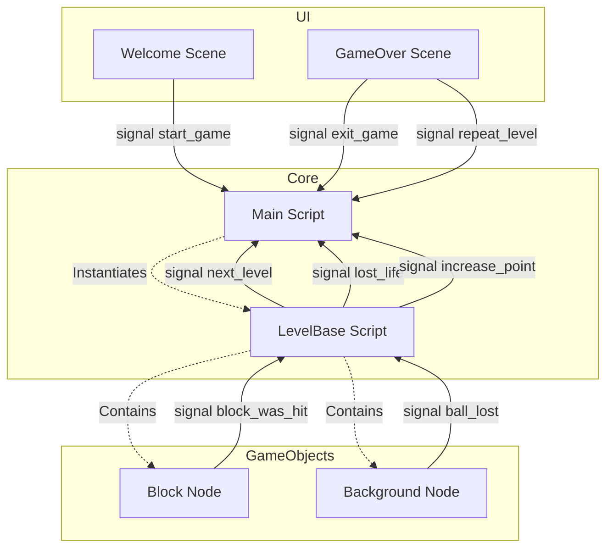

# Documentación del Proyecto Arkanoid

Esta documentación detalla la estructura del proyecto, el flujo de carga de niveles y la interacción entre las escenas mediante señales.

## Diagrama de Clases

Este diagrama muestra las clases principales del proyecto, sus variables clave y métodos, así como las relaciones de herencia y composición.

## Diagrama de Secuencia: Flujo de Carga de Niveles

Este diagrama ilustra cómo se inicia el juego y cómo se gestiona la transición entre niveles desde el script `Main`.

## Diagrama de Interacción y Señales

Este diagrama muestra las principales señales emitidas por los distintos nodos y quién las escucha, definiendo la arquitectura de eventos del juego.

