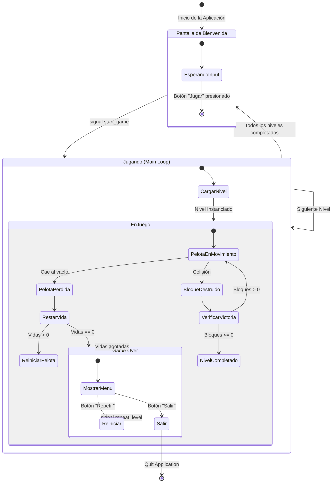
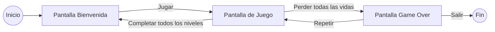

# Arquitectura y Diagramas Adicionales

## Máquina de Estados del Juego

Este diagrama representa los estados de alto nivel del juego y las transiciones entre ellos.



## Árbol de Escenas (Scene Tree)

Estructura jerárquica de los nodos en tiempo de ejecución.

```mermaid
graph TD
    Root[root (Window)]
    Main[Main (Node)]
    
    subgraph UI_Layer
        Welcome[Welcome (Control)]
        UI[UI_Points (Control)]
        GameOver[GameOver (Control)]
    end
    
    subgraph Dynamic_Level
        Level[Current Level (Node2D)]
        Background[Background (Node2D)]
        Player[Player (CharacterBody2D)]
        Ball[Ball (CharacterBody2D)]
        BlockList[block-list (Node)]
        Block1[Block (StaticBody2D)]
        Block2[Block (StaticBody2D)]
        BlockN[Block... (StaticBody2D)]
    end

    Root --> Main
    Main --> Welcome
    Main --> UI
    Main --> GameOver
    Main --> Level
    
    Level --> Background
    Level --> Player
    Level --> Ball
    Level --> BlockList
    BlockList --> Block1
    BlockList --> Block2
    BlockList --> BlockN
```

## Flujo de Navegación de Pantallas


